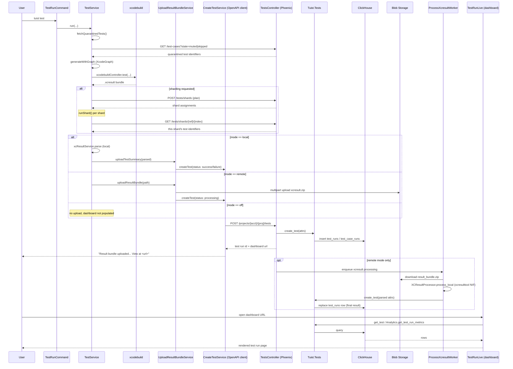

# Research: Analiza mechanizmu TestService

**Date**: 2026-09-05T19:55:03+02:00
**Researcher**: Mikołaj Chmielewski
**Git Commit**: 92e9a72f2755bfc38f6e15b904a386ac10fb1eeb
**Branch**: 10x-devs
**Repository**: tuist

## Research Question

> Przeanalizuj mechanizm TestService, zwracając szczególną uwagę na powiązane z nim obszary zdefiniowane w `context/map/repo-map.md`.
>
> Trzy równoległe osie analizy:
> 1. **Trace e2e** — ścieżka od entry pointu, przez warstwy, do zapisu/odczytu i z powrotem, z sekwencją kroków `file:line` i diagramem Mermaid.
> 2. **Luki w testach** — które metody i gałęzie na tej ścieżce mają pokrycie, a które nie.
> 3. **Blast radius** — co musi zmienić się razem przy zmianie tego przepływu (szew interfejsu, warstwy generowane, model, migracje, testy), łącząc graf statyczny z co-change z historii gita.
>
> Zakres: wyłącznie analiza i opis stanu obecnego repozytorium. Raport musi zawierać sekcje **Feature overview** i **Technical debt**.

`context/map/repo-map.md` (artefakt onboardingowy, §4 "Strefy ryzyka") wskazuje `cli/Sources/TuistKit/Services/TestService.swift` jako strefę ryzyka #1: najgorętszy plik CLI (73 zmiany/12 mies.), 17 wstrzykiwanych protokołów (liczba zweryfikowana w tym badaniu jako **27**, patrz niżej), test na 7002 linie z 24 mockami, god-service z jednym głównym właścicielem (Marek Fořt, 56/74 commitów). Repo-map łączy to czasowo z `server/lib/tuist/tests.ex` jako serwerowy odpowiednik tego samego tematu roku (`tuist test` / analityka testów), ale zaznacza, że strona Elixir nie ma zweryfikowanego grafu importów — to badanie zamyka część tej luki dla przepływu `tuist test` konkretnie.

## Summary

`TestService.swift` (2322 linie) to orkiestrator komendy `tuist test`: od parsowania argumentów, przez generowanie grafu projektu, wykonanie `xcodebuild`, aż po opcjonalny upload wyniku na serwer (ClickHouse) i asynchroniczne przetwarzanie `.xcresult` przez dedykowany worker Oban na flocie macOS. Przepływ ma dwa niezależne tryby (`local` / `remote` / `off`) różniące się tym, gdzie parsowany jest `.xcresult` i co trafia na serwer, plus podsystem shardingu, w którym serwer aktywnie steruje wykonaniem CLI (przydział shardów na podstawie historycznej analityki czasu trwania testów).

Pokrycie testami jest szerokie liczbowo (>150 testów w pliku 7002 linii), ale **płytkie w newralgicznych miejscach**: najważniejsza funkcjonalna gałąź kwarantanny testów (`onlyQuarantinedTestsFailed == true` → run się nie wywraca) nie jest przetestowana ani razu — mock zawsze zwraca `false`. Ścieżka `.remote` uploadu (`uploadResultBundleService.uploadResultBundle`) też nigdy nie jest weryfikowana. Wszystkie ścieżki błędów uploadu są nietestowane.

Blast radius jest większy niż sugerował sam plik: statyczny graf i historia gita zgodnie wskazują ukrytego "bliźniaka" — `XcodeBuildTestCommandService.swift` — dzielącego **15 z 16 swoich własnych zależności** (94%, zweryfikowane przez ast-grep — silniej niż wcześniej szacowane "~14") z `TestService` i współzmieniającego się w 36% commitów. To największe pojedyncze ryzyko architektoniczne wykryte w tym badaniu, silniejsze niż sama sprzężenie z serwerem przez wygenerowany klient OpenAPI (które jest dobrze odizolowane przez `CreateTestServicing`/`UploadResultBundleServicing`).

## Feature overview

**Co robi `tuist test` (pełny przepływ, potwierdzony trasowaniem od `TestRunCommand.swift` do dashboardu):**

1. **Wejście CLI** — `cli/Sources/TuistTestCommand/TestRunCommand.swift:410-466` konstruuje `TestService` i wywołuje `run(...)` z flagami (m.in. shard flags, `--no-upload`, `--inspect-test-mode`).
2. **Walidacja i tryb** — `TestService.swift:207-216` (`validateParameters`) i `:279` (`TestProcessingMode.default(for:)`, `TestProcessingMode.swift:13-19`) — tryb `remote` dla `*.tuist.dev`/localhost, `local` w przeciwnym razie.
3. **Kwarantanna (round-trip serwera, przed uruchomieniem)** — `:281-285`/`:617-649` (`fetchQuarantinedTests`) → `TestCaseListService.swift:30-61` → OpenAPI `listTestCases` → `GET .../test-cases?state=muted|skipped`. Wynik zasila pomijanie testów skazanych na "skipped" i późniejsze traktowanie "muted" jako niekrytycznych.
4. **Generowanie grafu / selective testing** — `:349-368` buduje generator świadomy cache selektywnego (binary cache) i woła `generateWithGraph`.
5. **Rozwiązanie schematu/planu testów** — `:405-511`, wczesne wyjścia gdy nic do zrobienia (`finishSkippedTests`, `:1448`).
6. **Sharding (round-trip serwera, opcjonalny)** — plan: `:590-610` → `ShardPlanService.swift:104-195` → `POST .../tests/shards` → `server/lib/tuist_web/controllers/api/shards_controller.ex:119-148` → `Shards.create_shard_plan/2` (bin-packing na podstawie historycznej analityki czasu testów, `server/lib/tuist/shards/analytics.ex`, `bin_packer.ex`). Wykonanie shardu: `:654-781` (`runShard`) → `ShardService.swift:80-...` → `GET .../tests/shards/{ref}/{index}` — serwer mówi CLI dokładnie które identyfikatory testów uruchomić/pominąć.
7. **Wykonanie** — `:1780-1959` (`testScheme`) → `:1890-1910` — właściwe wywołanie `xcodebuild test` / `build-for-testing` / `test-without-building`.
8. **Upload wyniku (round-trip serwera, po każdym schemacie/shardzie)** — `:1985-2013` (`uploadBuildRunIfNeeded`) i `:2015-2070` (`uploadResultBundleIfNeeded`), rozgałęzione wg trybu:
   - `.local`: parsowanie `.xcresult` lokalnie (`xcResultService.parse`, `:1961-1969`) → `uploadResultBundleService.uploadTestSummary(...)`.
   - `.remote`: upload surowego archiwum `.xcresult` do blob storage (multipart, `AnalyticsArtifactUploadService.swift:211-228`) → `uploadResultBundleService.uploadResultBundle(...)` ze statusem `"processing"`.
   - `.off`: brak uploadu, dashboard nie jest zasilany.
9. **Zapis na serwerze** — `CreateTestService.swift:58-300` → OpenAPI `createTest` (`POST /api/projects/{account}/{project}/tests`, `server.yml:8860`/`9081`) → `server/lib/tuist_web/router.ex:688` → `TestsController.create/2` (`tests_controller.ex:538-607`) → `Tuist.Tests.create_test/1` (`server/lib/tuist/tests.ex:478-541`) → zapis do **ClickHouse** (`IngestRepo`/`ClickHouseRepo`, tabela `test_runs` + fan-out `test_case_runs`/`test_module_runs`/`test_suite_runs`, ReplacingMergeTree dedup) — **nie Postgres**.
10. **Asynchroniczne przetwarzanie `.xcresult` (tylko tryb `.remote`)** — `TestsController` enqueue'uje `ProcessXcresultWorker` (Oban, kolejka `:process_xcresult`, dedykowana flota macOS bo wymaga `xcresulttool`) → pobiera zip z blob storage → `XCResultProcessor.process_local` (natywny Swift NIF) → ponownie `Tests.create_test/1`, nadpisując placeholder "processing" ostatecznym wynikiem. Broadcast przez osobnego workera (`BroadcastTestCreatedWorker`), bo procesor działa na izolowanym node'zie bez PubSub do web-tier.
11. **Odczyt (dashboard, bez udziału CLI)** — `server/lib/tuist_web/live/tests_live.ex` i `test_run_live.ex` czytają z `Tuist.Tests`/`Tuist.Tests.Analytics` z powrotem z ClickHouse; URL do konkretnego runu jest zwracany CLI i wypisywany użytkownikowi (`TestService.swift:2060-2063`).
12. **Selective testing (osobna pętla, cache, nie analytics)** — `:1130-1160`/`:1653` zapisują hash sukcesu testu per-target do **cache storage** (binary cache, nie do sklepu analityki testów); odczyt po stronie generatora/mappera nie został w pełni prześledzony w tym badaniu (patrz Open Questions).

### Diagram Mermaid — pełny przepływ

**CLI-only (bez round-tripu serwera):** parsowanie argumentów, generowanie grafu/build-for-testing/wywołanie `xcodebuild`, lokalne parsowanie `.xcresult` (tryb `.local`), logika *oznaczania* kwarantanny nad już pobranymi danymi.

**Round-trip serwera:** pobranie listy kwarantanny (przed runem), planowanie i przydział shardów (przed i w trakcie runu), upload wyniku po każdym schemacie/shardzie, upload/download hashy selective-testing (osobny cache, nie analytics), wszystkie odczyty dashboardu.

## Detailed Findings

### 1. Trace e2e — kluczowe punkty i sprzężenia zwrotne (feedback loops)

Poza liniowym przepływem opisanym w Feature overview, zidentyfikowano trzy miejsca, gdzie serwer aktywnie informuje zwrotnie działanie CLI (nie tylko przyjmuje dane):

- **Kwarantanna** — `TestService.swift:617-649` → `TestCaseListService.swift:30-61` → GET listy testów `muted`/`skipped`. Zasila `skipTestTargets` i pomijanie nieudanych-ale-mutowanych testów.
- **Sharding** — plan (`ShardPlanService.swift:104-195`, POST) i wykonanie (`ShardService.swift:80-...`, GET) — serwer balansuje shardy na podstawie `server/lib/tuist/shards/analytics.ex`/`bin_packer.ex` i mówi CLI dokładnie co uruchomić.
- **Selective testing hashes** — zapis potwierdzony (`TestService.swift:1130-1160`, `:1653`, `:1398-1424`), ale dokładne miejsce *odczytu* przy generowaniu grafu (poza `TestService.swift`, prawdopodobnie w warstwie mappera `TuistGenerator`) nie zostało w tym badaniu zlokalizowane — patrz Open Questions.

Nietrywialny szczegół: tryb `.local` i `.remote` różnią się nie tylko tym *co* jest wysyłane, ale też *gdzie* faktycznie żyje parsowanie `.xcresult` — CLI (`.local`) vs. dedykowany serwerowy NIF na macOS (`.remote`, `server/native/xcresult_nif/`, potwierdzone w `AGENTS.md` i przez `process_xcresult_worker.ex:229-267`).

Pełna tabela kroków z `file:line` i uzasadnieniem znajduje się w sekcji [Code References](#code-references) niżej — pochodzi z pełnego trasowania wykonanego w tym badaniu.

### 2. Luki w testach

Plik testowy (`cli/Tests/TuistKitTests/Services/TestServiceTests.swift`, 7002 linie, 24 mocki) przeczytany w całości i porównany metoda-po-metodzie z `TestService.swift`.

**Pokrycie jest szerokie ilościowo, ale są konkretne, nazwane luki:**

| Metoda/gałąź (`file:line`) | Status | Dowód |
|---|---|---|
| `run()` główna ścieżka, walidacja, scheme/plan resolution | Pokryte | Dziesiątki `test_run_*`, `test_validateParameters_*` |
| `fetchQuarantinedTests` (happy path, skip, network failure) | Pokryte | `TestService.swift:617-649`, testy 4089/4288/4370/4451 |
| `runShard`, `runTestWithoutBuildingFromBundle`, `computeSelectiveTestingGraph` | Pokryte | Duży klaster testów (1412-2456, 4686-5895) |
| **`onlyQuarantinedTestsFailed == true` → run nie wywraca się mimo failure (`:1391-1393`, `:1284-1298`)** | **Niepokryte — wysokie ryzyko** | Mock zwraca `false` we WSZYSTKICH 5 wystąpieniach w pliku testowym (linie 160-164, 4115, 4217, 4471); rdzeń funkcjonalny kwarantanny na poziomie kontynuacji multi-scheme nigdy nie jest ćwiczony |
| **`.remote` mode — `uploadResultBundleService.uploadResultBundle(...)` (`:2047-2063`)** | **Niepokryte** | Nigdy nie jest stubowane/weryfikowane; jedyny test `mode: .remote` sprawdza inną ścieżkę (wszystkie testy pominięte) |
| Wszystkie ścieżki błędów uploadu (`uploadResultBundleIfNeeded` catch `:2067-2069`, `uploadBuildRunIfNeeded` catch `:2010-2012`, fallback merge `.xcresult` `:1766-1776`) | **Niepokryte** | Żaden test nie zmusza zamockowanych serwisów do rzucenia wyjątku |
| `schemeWithoutTestableTargets` (`:1829-1832`) i `unspecifiedPlatform` (`:1834-1862`) throws | **Niepokryte na poziomie integracyjnym** | Testowane są tylko sąsiednie warianty/czyste funkcje pomocnicze, nie faktyczne rzucenie tych błędów przez `run()`/`testScheme` |
| `resolveTestProductsPath` — fallback po derivedDataPath glob i throw `testProductsNotFound` (`:1012-1026`) | **Niepokryte** | Testowana tylko ścieżka jawnego argumentu `-testProductsPath` |
| `generateOnly` early return (`:370-372`) | **Niepokryte** | Parametr nigdy nie jest wywołany z `true` w całym pakiecie testów |
| **Martwy kod**: `xcodebuildDestination`, `simulatorPlatform`, `xcodebuildPlatform`, `hasConcreteDevice`, `xcodebuildDestinationParameter` (`:2239-2309`, ~70 linii) i `passedValue` (`:2170-2175`) | Nieosiągalne z żywego kodu (`run()` i jego wywoływane funkcje) w całym `cli/Sources`/`cli/Tests` (zweryfikowane przez ast-grep, patrz [Weryfikacja strukturalna](#weryfikacja-strukturalna-ast-grep)) — **doprecyzowanie**: nie wszystkie 5 mają dosłownie zero call site'ów; `xcodebuildPlatform` jest wołane raz (`:2268`, przez martwe `simulatorPlatform`), a `xcodebuildDestinationParameter` trzy razy (`:2273`, `:2290-2291`, przez martwe `xcodebuildPlatform`/`hasConcreteDevice`) — to samowystarczalny klaster 5 metod odwołujących się wyłącznie do siebie nawzajem, odcięty od `run()` | Nie jest to luka testowa — to zalegający kod do usunięcia (całym klastrem, nie pojedynczymi metodami) |

**Ryzyko architektoniczne izolacji:** 24 mocki oznaczają, że >150 testów weryfikuje głównie *sekwencjonowanie wywołań i przekazywane argumenty*, a nie faktyczne zachowanie `XCResultService`, `UploadResultBundleService` czy `TestQuarantineService`. Skoro `onlyQuarantinedTestsFailed` i `uploadResultBundleService.uploadResultBundle` są zamockowane i zawsze stubowane tą samą stałą wartością w całym pakiecie, błąd w prawdziwej implementacji tych serwisów — albo regresja w sposobie okablowania trybu `.remote` — **nie zostałby wykryty przez żaden z tych testów**.

### 3. Blast radius

**Wstrzykiwane zależności — zweryfikowana liczba to 27, nie 17** (liczba z repo-map.md jest nieaktualna). Podział:

- **Cienkie szwy** (18 protokołów) — ogólna infrastruktura/OS, reużywana w dziesiątkach serwisów CLI (`XcodeBuildControlling`, `GitControlling`, `Clock`, `CIControlling`, `FileSysteming` itd.) — wymienialne bez dotykania logiki biznesowej tego pliku.
- **Sprzężenie konkretne** (9 protokołów) — kontrakty domenowe niosące typy wygenerowane z OpenAPI (`CreateTestServicing`, `UploadResultBundleServicing`, `ShardPlanServicing`, `ShardMatrixOutputServicing`, `TestCaseListServicing`) lub wewnętrzne protokoły istniejące wyłącznie dla wstrzykiwania mocków (`TestQuarantineServicing`, `ShardServicing`).

**Co-change (73 commity dotykające `TestService.swift` w 12 mies., pełna analiza commitów, nie tylko path-filtered):**

| Plik | Współwystąpienia | Charakter |
|---|---:|---|
| `cli/Tests/TuistKitTests/Services/TestServiceTests.swift` | 60/73 (82%) | Zdrowe parowanie kod↔test |
| **`cli/Sources/TuistKit/Services/XcodeBuild/XcodeBuildTestCommandService.swift`** | **26/73 (36%)** | **Sprzężenie architektoniczne — "ukryty bliźniak"**, dzieli 15 z 16 własnych zależności (94%, zweryfikowane ast-grep) z `TestService` |
| `XcodeBuildTestCommandServiceTests.swift` | 22/73 (30%) | Konsekwencja powyższego |
| `cli/Sources/TuistServer/OpenAPI/{Types.swift, server.yml}` | 14/73 (19%), sparowane w 100% commitów regen | Generowane, ale wiążące — wymuszone przez `server/lib/tuist_web/api/schemas/tests/test.ex` i `.../shards/shard_plan.ex` |
| `cli/Sources/TuistKit/Services/InspectResultBundleService.swift`, `CreateTestService.swift` | 13, 9 | Architektoniczne — współdzielą schemat `RunsTest` |
| `cli/Sources/TuistKit/Services/Sharding/{ShardService,ShardPlanService,ShardMatrixOutputService}.swift` | 9 każdy | Architektoniczne — klaster shardingu |
| `server/lib/tuist/shards.ex`, `server/lib/tuist_web/controllers/api/{tests,shards}_controller.ex` | 7 każdy | Rzeczywiste sprzężenie cross-service |
| `server/lib/tuist/tests.ex` | 5/73 (7%) | Rzeczywiste sprzężenie cross-service (potwierdza i kwantyfikuje obserwację z repo-map) |
| `server/priv/ingest_repo/migrations/*` (ClickHouse) | 7/73 commitów dotyka choć jednej | Rzeczywiste sprzężenie — schemat analityki testów (ClickHouse) ewoluuje razem z CLI |
| `Tuist/ProjectDescriptionHelpers/Module.swift`, `Package.swift`, `Package.resolved` | 15, 11, 6 | **Szum mechaniczny** — dotykane przy każdym dużym PR wieloobszarowym, zweryfikowane per-commit |
| `server/priv/repo/migrations/*` (Postgres) | 1/73 | Szum — pojedyncze trafienie niezwiązane tematycznie |
| `cli/Tests/Fixtures/test.xcresult/**` | 1/73, jeden commit | Jednorazowa masowa regeneracja, nie powtarzalne sprzężenie |

**Zweryfikowany fakt zamykający lukę z repo-map §3 ("unknown — brak grafu" po stronie Elixira):** dane testowe (`Tuist.Tests.Test`, tabela `test_runs` + fan-out) żyją w **ClickHouse** (`IngestRepo`/`ClickHouseRepo`), nie w Postgres — potwierdzone przez `server/lib/tuist/tests/test.ex:1-28` i wzorzec ReplacingMergeTree w `tests.ex`. Stan `Shards.ShardPlan`/`ShardRun` (Postgres czy ClickHouse?) pozostaje niepotwierdzony — patrz Open Questions.

**Werdykt blast radius (ranking wg siły dowodu):**
1. `TestServiceTests.swift` — musi się zmieniać niemal zawsze (oczekiwane).
2. **`XcodeBuildTestCommandService.swift` + jego testy** — największe pojedyncze ryzyko duplikacji: zmiana w uploadzie wyniku, kwarantannie, shardingu czy activity-logu w `TestService` musi być ręcznie zwierciadlana tutaj.
3. `cli/Sources/TuistServer/OpenAPI/{Types,server.yml}` — bezpośrednia zależność od wygenerowanych typów; źródło wymuszenia to schematy Elixir po stronie serwera.
4. `InspectResultBundleService.swift`, `CreateTestService.swift` — współdzielą schemat `RunsTest`.
5. Klaster shardingu (`ShardService`/`ShardPlanService`/`ShardMatrixOutputService` + odpowiedniki serwerowe).
6. `server/lib/tuist/tests.ex`, `shards.ex`, kontrolery Phoenix — logika domenowa wymuszająca regenerację klienta.
7. Migracje ClickHouse (`server/priv/ingest_repo/migrations/*`) — realna substancja stojąca za współwystępowaniem z `tests.ex`.

**Najbezpieczniejszy szew:** granica schematu OpenAPI `RunsTest`/`ShardPlan` jest w większości dobrze zaprojektowana — `TestService.swift` przekazuje te typy przez `CreateTestServicing`/`UploadResultBundleServicing`/`ShardPlanServicing`, nie konstruuje ich samodzielnie w głównym przepływie. **Wyjątek, zweryfikowany przez ast-grep (patrz [Weryfikacja strukturalna](#weryfikacja-strukturalna-ast-grep)):** `outputEmptyShardMatrixIfNeeded` (`TestService.swift:1476-1488`) samodzielnie konstruuje pusty placeholder `Components.Schemas.ShardPlan(id: "", reference: "", shard_count: 0, shards: [], upload_url: "")` przed przekazaniem go do `shardMatrixOutputService.output(...)`. To jedyny bezpośredni dotyk generowanego typu w tym pliku — granica jest niemal czysta, ale nie w 100%. Ryzyko regeneracji schematu pozostaje głównie po stronie serwera, ale ta jedna konstrukcja oznacza, że zmiana kształtu `ShardPlan` (np. dodanie wymaganego pola) złamie kompilację `TestService.swift` bezpośrednio, nie tylko przez serwisy pośredniczące.

## Technical debt

To jest krytyczna sekcja tego badania — poniższe punkty są uszeregowane wg realnego ryzyka/kosztu, nie kolejności odkrycia.

1. **Nieprzetestowana kontynuacja kwarantanny (`onlyQuarantinedTestsFailed`) — najwyższe ryzyko funkcjonalne.** Cel istnienia kwarantanny testów — żeby run się nie wywrócił, gdy zawiodły wyłącznie testy w kwarantannie — jest zaimplementowany (`TestService.swift:1284-1298`, `:1391-1393`), ale we wszystkich 5 miejscach w 7002-liniowym pliku testowym mock zwraca `false`. Regresja w tej logice przeszłaby przez CI niezauważona.
2. **`XcodeBuildTestCommandService.swift` jako niekontrolowany duplikat.** 15 z jego 16 zależności (94%, zweryfikowane ast-grep) pokrywa się z zależnościami `TestService`; oba pliki współzmieniają się w 36% commitów, co oznacza ręczną synchronizację logiki uploadu/kwarantanny/shardingu w dwóch miejscach. To najbardziej dźwigniowa pojedyncza refaktoryzacja wskazana przez to badanie — wydzielenie wspólnego orkiestratora (np. `TestExecutionOrchestrator`) przejmującego `uploadResultBundleService`, `testQuarantineService`, `testCaseListService`, `shardService`, `serverEnvironmentService`, `uploadBuildRunService`, `xcActivityLogController`.
3. **God-service z jednym właścicielem.** 2322 linie, 27 wstrzykiwanych zależności, 73 zmiany/12 mies., 56/74 commitów od jednej osoby (Marek Fořt wg repo-map). Bus factor = 1 dla najgorętszego pliku CLI.
4. **Martwy kod inflacyjący plik.** `xcodebuildDestination` i `simulatorPlatform`/`hasConcreteDevice` (`:2239-2292`) mają zero wywołań z jakiegokolwiek miejsca w `cli/Sources`/`cli/Tests`; `xcodebuildPlatform` i `xcodebuildDestinationParameter` (`:2272-2309`) mają wywołania, ale wyłącznie z wnętrza tego samego martwego klastra (`simulatorPlatform:2268`, `hasConcreteDevice:2290-2291`) — całość jest odcięta od `run()` i nieosiągalna z żywego kodu. `passedValue` (`:2170-2175`) jest osobnym martwym fragmentem, zduplikowanym co do ciała identycznie w 3 innych plikach: `XcodeBuildTestCommandService.swift`, `XcodeBuildBuildCommandService.swift`, `XcodeBuildArgumentParser.swift` (zweryfikowane diffem treści funkcji). Kandydaci do usunięcia całym klastrem, zero ryzyka regresji.
5. **Nieprzetestowana ścieżka `.remote` uploadu.** `uploadResultBundleService.uploadResultBundle(...)` — realny upload używany w trybie `.remote` (domyślnym dla `*.tuist.dev`) — nie jest nigdy stubowany/weryfikowany w teście. Jedyny test z `mode: .remote` sprawdza inną gałąź (wszystkie testy pominięte).
6. **Wszystkie ścieżki błędów uploadu są nieprzetestowane** — zarówno wyniku testów, jak i build-run correlation, jak i fallback przy nieudanym scaleniu `.xcresult` wielu schematów. Cichy fail (`warning`, nie `throw`) oznacza, że użytkownik może nie zauważyć, że wynik nigdy nie trafił na dashboard.
7. **Testy jako wyłącznie "wiring tests".** 24 mocki izolują `TestService` od każdego realnego collaboratora (parsowanie `.xcresult`, faktyczny upload HTTP, prawdziwa logika kwarantanny). Liczba testów (>150) sugeruje dobre pokrycie, ale mierzy głównie poprawność sekwencjonowania wywołań, nie poprawność end-to-end.
8. **Niezweryfikowany magazyn danych dla stanu shardingu.** `server/lib/tuist/shards/shard_plan.ex`/`shard_run.ex` wyglądają na schematy Ecto (Postgres), ale nie zostały otwarte w celu potwierdzenia repo — w przeciwieństwie do danych testów (potwierdzone ClickHouse), to pozostaje otwarte pytanie z bezpośrednim wpływem na to, jak liczyć blast radius migracji.
9. **Dwa niezależne wcielenia "przekazania kontroli wykonania testu serwerowi"** (kwarantanna + sharding) rosną w tym samym pliku bez wspólnej abstrakcji "pre-run server round-trip" — kolejny kandydat do konsolidacji przy okazji punktu 2.

## Code References

- `cli/Sources/TuistTestCommand/TestRunCommand.swift:410-466` — konstrukcja i wywołanie `TestService`
- `cli/Sources/TuistKit/Services/TestService.swift:207-2322` — cały orkiestrator (patrz tabela pokrycia i lista zależności wyżej dla konkretnych linii)
- `cli/Sources/TuistKit/Services/TestProcessingMode.swift:13-19` — rozstrzygnięcie trybu local/remote
- `cli/Sources/TuistKit/Services/TestQuarantineService.swift:7` — protokół kwarantanny (wewnętrzny, tylko do mockowania)
- `cli/Sources/TuistKit/Services/TestCaseListService.swift:30-61` — pobranie listy testów w kwarantannie
- `cli/Sources/TuistKit/Services/Sharding/ShardPlanService.swift:104-195`, `ShardService.swift:80-` — planowanie i wykonanie shardingu
- `cli/Sources/TuistKit/Services/InspectResultBundleService.swift:106-262` — upload testSummary / result bundle
- `cli/Sources/TuistKit/Services/XcodeBuild/XcodeBuildTestCommandService.swift` — duplikat/bliźniak `TestService` (patrz Technical debt #2)
- `cli/Sources/TuistServer/Services/CreateTestService.swift:58-300` — klient `createTest`
- `cli/Sources/TuistServer/Services/AnalyticsArtifactUploadService.swift:211-228` — multipart upload `.xcresult`
- `cli/Sources/TuistServer/OpenAPI/server.yml:8860,9081` — operacja `createTest`
- `cli/Tests/TuistKitTests/Services/TestServiceTests.swift` — 7002 linie, 24 mocki; konkretne numery linii testów cytowane w tabeli pokrycia wyżej
- `server/lib/tuist_web/router.ex:660-698` — scope `/tests`
- `server/lib/tuist_web/controllers/api/tests_controller.ex:538-607` — `TestsController.create/2`
- `server/lib/tuist_web/controllers/api/shards_controller.ex:119-148` — `ShardsController.create`
- `server/lib/tuist/tests.ex:478-541` — `Tests.create_test/1`
- `server/lib/tuist/tests/test.ex:1-28` — schemat ClickHouse `test_runs`
- `server/lib/tuist/tests/workers/process_xcresult_worker.ex:77-303` — asynchroniczne przetwarzanie `.xcresult`
- `server/lib/tuist_web/live/tests_live.ex`, `test_run_live.ex` — odczyt dashboardu

## Architecture Insights

- **Dwa niezależne mechanizmy round-trip serwera splecione w jednym pliku**: kwarantanna (pre-run, GET) i sharding (pre-run POST + mid-run GET) — obie realizują ten sam wzorzec "serwer instruuje CLI co robić na podstawie danych historycznych", ale bez współdzielonej abstrakcji.
- **Granica generowanego kodu jest niemal, ale nie w pełni, zamknięta**: `TestService.swift` w zdecydowanej większości nie dotyka bezpośrednio `Components.Schemas.*`/`Operations.*` z wygenerowanego klienta OpenAPI — przechodzi przez protokoły serwisowe (`CreateTestServicing`, `UploadResultBundleServicing` itd.). Jeden zweryfikowany wyjątek: `TestService.swift:1479` konstruuje `Components.Schemas.ShardPlan(...)` wprost (pusty placeholder dla `outputEmptyShardMatrixIfNeeded`). To ogranicza, ale nie eliminuje, blast radius zmian schematu w warstwie orkiestratora.
- **Rozdział lokalny/serwerowy dla parsowania `.xcresult`** (tryb `.local` w Swift, `.remote` w natywnym NIF na dedykowanej flocie macOS) to świadoma decyzja architektoniczna — wynika z zależności `xcresulttool` od macOS (por. `AGENTS.md` root, sekcja o `xcresult_nif`/`xcresult-processor-image`).
- **Testy jednostkowe w tym pliku weryfikują głównie "wiring", nie zachowanie** — wzorzec do rozpoznawania też w innych god-services repo (np. `TuistServer/Services` wskazany w repo-map §4 jako podobny, niezweryfikowany przypadek).

## Historical Context (from prior changes)

Brak — `context/changes/` i `context/archive/` nie zawierały żadnych wcześniejszych `research.md`/`plan.md` w momencie tego badania (katalogi zostały dopiero zainicjalizowane w tej samej sesji przez `/10x-init`).

## Related Research

Brak innych artefaktów badawczych w `context/changes/**/research.md` ani `context/archive/**/research.md` w momencie pisania.

## Weryfikacja strukturalna (ast-grep)

Wszystkie twierdzenia strukturalne z pierwszej wersji raportu (liczby call-site'ów, "tylko przez X", "nigdy", liczność metod/zależności) zostały wyekstrahowane i zweryfikowane niezależnie przez `ast-grep 0.45.3` (`--lang swift`) bezpośrednio na plikach źródłowych, zamiast polegać na odczycie sub-agentów. Poniżej pełna lista z werdyktem, wzorcem i dokładnymi liniami.

| # | Twierdzenie z raportu | Wzorzec ast-grep | Wynik | Werdykt |
|---|---|---|---|---|
| 1 | `TestService` ma dokładnie 27 wstrzykiwanych zależności (`private let`, linie 108-134) | `private let $NAME: $TYPE` na `TestService.swift` | Dokładnie 27 trafień, linie 108-134 | **POTWIERDZONE** |
| 2 | 18 z nich to "cienkie szwy" bez zależności od typów generowanych (OpenAPI) | Dla każdego z 18 plików deklaracji: `Components.Schemas.$X` / `Operations.$X` | 0 trafień we wszystkich 18 plikach | **POTWIERDZONE** |
| 3 | `TestService.swift` nigdy nie dotyka `Components.Schemas.*`/`Operations.*` bezpośrednio, tylko przez `CreateTestServicing`/`UploadResultBundleServicing` | `Components.Schemas.$X` / `Operations.$X` na `TestService.swift` | 1 trafienie: `Components.Schemas.ShardPlan(...)` na `TestService.swift:1479` (`outputEmptyShardMatrixIfNeeded`) | **OBALONE (częściowo)** — jeden bezpośredni wyjątek, raport skorygowany w sekcjach Blast radius i Architecture Insights |
| 4 | `onlyQuarantinedTestsFailed` jest stubowane `false` we wszystkich 5 miejscach w pliku testowym (linie 160-164, 4115, 4217, 4471) | `given(testQuarantineService).onlyQuarantinedTestsFailed($$$).willReturn($V)` na `TestServiceTests.swift` | Dokładnie 5 trafień, wszystkie `willReturn(false)`, linie zgodne co do joty | **POTWIERDZONE** |
| 5 | `uploadResultBundleService.uploadResultBundle(...)` nigdy nie jest stubowane/weryfikowane w testach | `given(uploadResultBundleService).uploadResultBundle($$$)` i `verify(...)` na `TestServiceTests.swift` | 0 trafień (jedyne wystąpienie identyfikatora to wstrzyknięcie w konstruktorze, linia 208) | **POTWIERDZONE** |
| 6 | 5 metod (`xcodebuildDestination`, `simulatorPlatform`, `xcodebuildPlatform`, `hasConcreteDevice`, `xcodebuildDestinationParameter`) jest "nieosiągalnych z żadnego call site, włącznie z tym plikiem" | `\b<nazwa>\(` w całym `cli/Sources`+`cli/Tests`, z wykluczeniem linii deklaracji | `xcodebuildDestination`, `simulatorPlatform`, `hasConcreteDevice` → 0 wywołań. `xcodebuildPlatform` → 1 wywołanie (`:2268`). `xcodebuildDestinationParameter` → 3 wywołania (`:2273`, `:2290`, `:2291`) | **DOPRECYZOWANE** — to samowystarczalny klaster 5 metod wołających wyłącznie siebie nawzajem, odcięty od `run()`; nie każda z osobna ma dosłownie zero call site'ów |
| 7 | `passedValue` jest zduplikowane identycznie w dokładnie 3 innych plikach i nieużywane wewnątrz `TestService.swift` | `func passedValue($$$) $$$` w `cli/Sources`; `passedValue(` w `TestService.swift` z wykluczeniem deklaracji | Deklaracja w dokładnie 4 plikach łącznie (TestService + 3 wskazane); ciała identyczne (zweryfikowane diffem); 0 wywołań w `TestService.swift` poza deklaracją | **POTWIERDZONE** |
| 8 | `generateOnly` nigdy nie jest wywołane z `true` w całym pakiecie testów | `generateOnly: true` (fallback: grep po identyfikatorze) na `TestServiceTests.swift` | 4 wystąpienia identyfikatora, wszystkie `false` (domyślne i jawne), 0×`true` | **POTWIERDZONE** |
| 9 | `XcodeBuildTestCommandService.swift` duplikuje ~14 z 27 zależności `TestService` | `private let $NAME: $TYPE` na obu plikach, przecięcie zbiorów po typie | 15 z 16 własnych zależności `XcodeBuildTestCommandService` (94%) pokrywa się typem z `TestService` | **DOPRECYZOWANE** — liczba dokładna to 15 (nie ~14), a właściwa miara to 94% własnego footprintu, silniejszy dowód duplikacji niż pierwotnie podano |
| 10 | `TestQuarantineServicing`/`TestCaseListServicing` to protokoły wewnętrzne (non-`public`), istniejące wyłącznie do wstrzykiwania mocków | `protocol $NAME` w plikach deklaracji, sprawdzenie modyfikatora `public` | Brak `public` przy obu deklaracjach (`TestQuarantineService.swift:7`, `TestCaseListService.swift:7`); dla porównania `ShardServicing` (`ShardService.swift:29`) jest `public protocol` | **POTWIERDZONE** |
| 11 | `testProductsNotFound` (throw w `resolveTestProductsPath`) nie jest w ogóle referencjonowane w pliku testowym | grep/ast-grep po identyfikatorze na `TestServiceTests.swift` | 0 trafień | **POTWIERDZONE** |

**Podsumowanie:** 8 z 11 twierdzeń strukturalnych potwierdzono dokładnie co do liczby i linii. Jedno zostało obalone (bezpośrednia konstrukcja `Components.Schemas.ShardPlan` w `TestService.swift:1479` — realny, choć pojedynczy, wyjątek od "czystej granicy" opisywanej w Blast radius). Dwa doprecyzowano: klaster martwego kodu ma wewnętrzne wywołania między swoimi elementami (nie jest to "zero call site's" dla każdej z 5 metod z osobna), a duplikacja `XcodeBuildTestCommandService` jest w rzeczywistości silniejsza (94%/15, nie ~14/27) niż pierwotnie oszacowano. Treść odpowiednich sekcji wyżej (Feature overview, Detailed Findings → Blast radius, Technical debt, Architecture Insights) została skorygowana zgodnie z tymi wynikami.

## Open Questions

1. Dokładne miejsce *odczytu* `mapperEnvironment.targetTestHashes` przy generowaniu grafu (selective testing skip) — poza `TestService.swift`, prawdopodobnie w module mappera `TuistGenerator`, nie zlokalizowane w tym przebiegu badania.
2. Czy `server/lib/tuist/shards/shard_plan.ex`/`shard_run.ex` piszą do Postgres czy ClickHouse — pliki zlokalizowane, nie otwarte w celu potwierdzenia repo.
3. `tuist test list`/`show`/`case` (`cli/Sources/TuistTestCommand/Test*CommandService.swift`) — zlokalizowane, nie zweryfikowane w głębi; prawdopodobnie ten sam wzorzec klient OpenAPI → kontroler GET co ścieżki odczytu #23-25 z trasowania e2e, ale nie potwierdzone plik-po-pliku.
4. Czy `resolveTestProductsPath`/`testProductsNotFound` i `generateOnly` to faktycznie martwe ścieżki produkcyjne (nieużywane przez żadną obecną flagę CLI), czy tylko nieprzetestowane — wymaga sprawdzenia wywołujących w `TestRunCommand.swift` i pokrewnych komendach.
