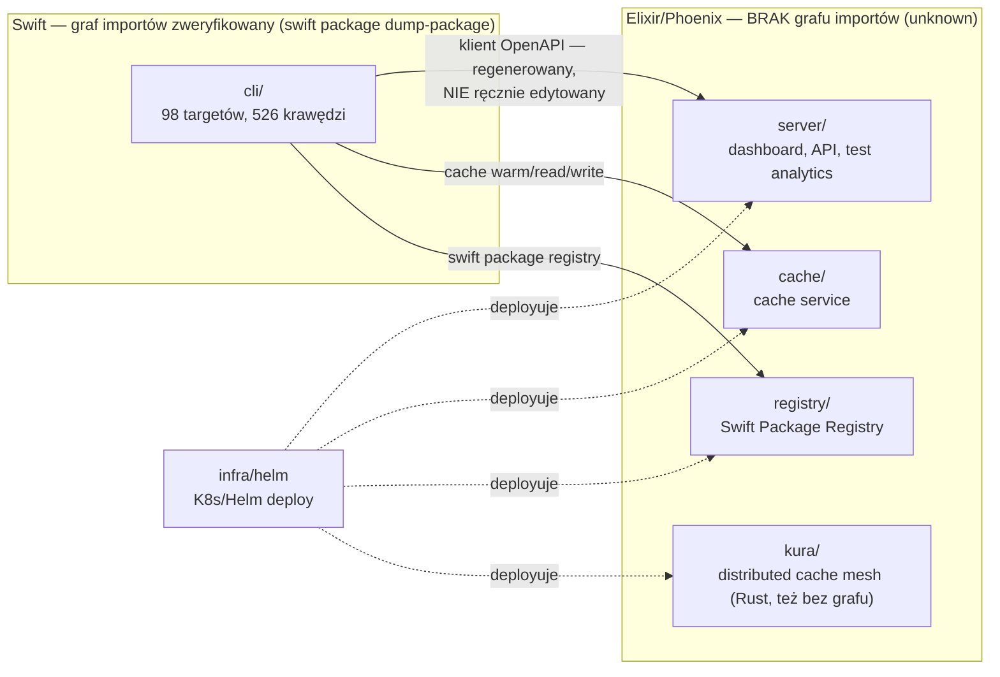

# Mapa repo Tuist — onboarding

> Zbudowane z trzech artefaktów: [`artifact-1-territory.md`](./artifact-1-territory.md) (aktywność git, 12 mies.), [`artifact-2-structure.md`](./artifact-2-structure.md) (graf zależności Swift), [`artifact-3-contributors.md`](./artifact-3-contributors.md) (kontrybutorzy 5 obszarów ryzyka w `cli/`). Ta mapa nie generuje nowych danych — łączy trzy perspektywy i mówi wprost, gdzie się rozjeżdżają.

## 1. TL;DR

Tuist to monorepo: CLI w Swift (`cli/`) generujący i cache'ujący projekty Xcode, serwer Elixir/Phoenix (`server/`) z dashboardem, API i analityką buildów/testów, oraz zestaw satelitarnych serwisów Elixir (`cache/`, `registry/`, `kura/`) deployowanych przez Helm na Kubernetesa (`infra/`). Najwięcej realnej pracy ostatnich 12 miesięcy poszło w LiveView-y dashboardu serwera, `cli/Sources/TuistKit` i logikę serwisu cache — a najgorętszym *tematem* roku (widocznym po obu stronach: CLI i serwer) jest `tuist test` / analityka testów. Boli w dwóch miejscach na raz: architektonicznie `TuistKit` po stronie CLI jest przerośniętym hubem (fan-out 54) obsługującym część komend "po staremu", a organizacyjnie dwie osoby (Marek Fořt, Pedro Piñera) pokrywają całość pięciu zbadanych obszarów ryzyka w CLI. Po stronie Elixir (serwer, cache, registry, kura) nie istnieje żaden graf importów — poniższe diagramy to jedyny "graf zależności", jaki ta mapa może pokazać dla tamtej części stacku.

## 2. Teren

**Duża odpowiedzialność vs peryferia** (wg zmian plików w 12 mies., artifact-1 §a): praca skupia się w `server/lib/tuist_web/live` (1419), `cli/Sources/TuistKit` (991), `cache/lib/cache` (538) i `cli/Sources/XcodeGraph` (463). Peryferia to katalogi obecne w drzewie, ale prawie nietknięte ręcznie: `cli/TuistCacheEE` (wskaźnik submodułu), `assets/` (statyczne obrazki, manifest Swift martwy od 2020), `examples/xcode/generated_*` (referencyjne projekty aktualizowane *mechanicznie* przy każdej zmianie logiki generowania — to snapshot, nie ręczna edycja).

**Moduły głębokie vs płytkie** (graf importów CLI, artifact-2 §a-b): najgłębsze/najbardziej "fundamentowe" wg fan-in to `TuistSupport` (38), `TuistServer` (36), `TuistEnvironment` (35), `TuistLogging` (31) — zmiana tutaj rozchodzi się szeroko. Płytkie/peryferyjne: 20 targetów `*Command` (fan-in ≈0–3, jeden = jedna komenda) oraz `TuistDependencies` — fan-in 1, "cichy pasażer" łańcuchowo zależny od miejsc, które w ogóle nie pojawiają się w top-10 aktywności.

**Aktywność w czasie — fale sekwencyjne, nie równoległe** (artifact-1 §d):

| Kwartał | Temat |
|---|---|
| Q1 (wrz–gru) | Build/inspect analytics |
| Q2 (gru–mar) | Refaktor grafu projektu + wydzielenie `XcodeGraph` jako pakietu (PR #9616) |
| Q3 (mar–cze) | Ostry zwrot w stronę `tuist test` — najbardziej skoncentrowany kwartał roku |
| Q4 (cze–wrz, bieżący) | SwiftPM (`PackageInfoMapper`) + odbicie `TuistServer/Services` i `TuistCache` (oba najwyższe w roku) |

**Gdzie struktura katalogów NIE odpowiada aktywności/architekturze:**
- `TuistKit` topologicznie leży *nad* warstwą komend (fan-out 54), ale semantycznie powinien leżeć pod nią — to relikt sprzed podziału na `*Command`. W repo współistnieją dwa modele: "czysty" (`*Command` → usługi aplikacyjne → rdzeń → fundament) i "stary" (`*Command` → `TuistKit` → prawie wszystko: `TuistTestCommand`, `TuistBuildCommand`, `TuistGenerateCommand`, `TuistRunCommand`, `TuistInspectCommand`, `TuistShareCommand`).
- `router.ex` *wygląda* jak plik-worek dotykany przez wszystko (43 różne obszary), ale zweryfikowano commit-po-commicie: brak jednego dominującego commita, rozłożone na dziesiątki PR-ów → to prawdziwy węzeł architektoniczny, nie szum.
- `mise.toml` też dotyka 43 obszarów (412 commitów), ale to odwrotny przypadek: manifest wersji bumpowany mechanicznie przy każdym `[Release]` — szum, nie sprzężenie.

## 3. Realne powiązania

Źródło jest zaznaczone przy każdej pozycji — **graf importów** (`dump-package`, tylko Swift/`cli/`), **historia gita** (co-occurrence commitów, całe repo), albo **unknown** (obszar, którego żadne narzędzie tu nie objęło).

**Sprzężenia potwierdzone z historii gita (co-occurrence w `cli/`, artifact-1 §e):**

| Para | Commity | Charakter |
|---|---:|---|
| `TuistKit/Services` ↔ `Tests/TuistKitTests` | 163 | zdrowe — kod i test niemal zawsze razem |
| `TuistGenerator` ↔ `Tests/TuistGeneratorTests` | 131 | zdrowe |
| `TuistLoader` ↔ `Tests/TuistLoaderTests` | 111 | zdrowe |
| `TuistKit/Commands` ↔ `TuistKit/Services` | 62 | architektoniczny hub |
| `TuistKit/Services` ↔ `TuistServer/Services` | 52 | rozwój klienta API napędzany przez CLI, nie API-first (`TuistServerTests` tylko 23 co-occurrence) |

**Sprzężenie potwierdzone grafem importów I historią jednocześnie:** `TuistGenerator → TuistServer` (edge w `dump-package`) — i to dwa niezależnie najaktywniejsze obszary roku (Q2 refaktor grafu: 131 zmian; Q4 `TuistServer/Services`: 116 zmian, najwyższe w roku). To rzadki przypadek, gdzie graf i git się zgadzają.

**Zero formalnych cykli** (Tarjan na 98 węzłach/526 krawędziach — SwiftPM je strukturalnie wyklucza), ale realne "efektywne cykle" / gęste sprzężenie (graf importów):
- `TuistKit` jako hub — 7 targetów zależy wprost (fan-out 54); zmiana ryzykuje przetestowaniem niemal wszystkich aktywnych komend naraz.
- `TuistExtension` jako drugi hub — zależy od 6 aktywnych obszarów naraz (`TuistCache`, `TuistCore`, `TuistGenerator`, `TuistHasher`, `TuistServer`, `XcodeGraph`), ale wg historii gita (artifact-3 §5) to w praktyce wyłącznie powierzchnia CLI dla `cache warm` — topologia przesadza z opisem realnego ryzyka.
- Diament `XcodeGraph`/`XcodeGraphMapper`/`XcodeMetadata` — `TuistCore` zależy jednocześnie od obu końców diamentu; zmiana typu może wymagać koordynacji w 3 miejscach.
- `TuistCacheCommand`/`TuistBazelCommand` — niemal identyczny zestaw zależności bez wspólnego kodu; poprawka fundamentu weryfikowana osobno w obu miejscach.

**Sprzężenia "tanie" — regeneracja/mock, nie ręczna edycja** (jawnie odfiltrowane w artifact-1, ale warto znać przy ocenie kosztu zmiany):
- `cli/Sources/TuistServer/OpenAPI/{Types,Client}.swift` + `server.yml` — generowane z serwera, CLAUDE.md zabrania ręcznej edycji.
- `examples/xcode/generated_*` — referencyjne projekty aktualizowane mechanicznie przy zmianie logiki generatora.
- `cli/Tests/Fixtures/**` — snapshoty binarne (`.xcresult`), nie kod.
- `mise.toml`, `mise.lock`, `Package.resolved`, `.github/workflows/release.yml` i cała rodzina release'owa — bump mechaniczny przy `[Release]`.
- `cli/TuistCacheEE` — wskaźnik submodułu, nie kod.

**Unknown — brak grafu, nie brak powiązań:**
- Cała strona Elixir (`server/`, `cache/`, `registry/`, `kura/`, `tuist_common/`) — żadne narzędzie w tej analizie nie zbudowało grafu importów/modułów. Wiemy tylko *które katalogi* są aktywne razem z historii gita (np. `TestService.swift` po stronie CLI koreluje czasowo z `server/lib/tuist/tests.ex` po stronie serwera — oba to top pliki roku w temacie testów), ale **nie wiemy**, jakie moduły Elixir faktycznie się importują ani czy tam są cykle.
- Frontend serwera (`server/assets/app`, TS/JS) — również bez grafu zależności, tylko git co-occurrence.
- Cykle *wewnątrz* jednego targetu Swift (np. pliki w `TuistKit/Services` vs `TuistKit/Commands`) — poza zasięgiem `dump-package`, które widzi tylko granice targetów (artifact-2 §g).
- `assets/Package.swift` — manifest istnieje, ale dump zakończył się błędem (`swift-tools-version 3.1.0` nieobsługiwany); traktuj jako martwy, nie jako "zero powiązań".

## 4. Strefy ryzyka

| # | Obszar | Dlaczego |
|---|---|---|
| 1 | `cli/Sources/TuistKit/Services/TestService.swift` | Najgorętszy plik CLI (73 zmiany), 17 wstrzykiwanych protokołów, test na 7002 linie z 24 mockami — god-service z jednym właścicielem |
| 2 | `TuistKit` (moduł-hub) | Fan-out 54, 7 aktywnych komend zależy wprost — zmiana tu ryzykuje regresję niemal całego CLI naraz; dwa współistniejące modele warstwowania utrudniają ocenę skutków |
| 3 | `server/lib/tuist_web/router.ex` | Zweryfikowany prawdziwy węzeł architektoniczny (43 obszary, 152 zmiany, brak jednego dominującego commita) — każda nowa funkcja dashboardu/API przez niego przechodzi |
| 4 | `TuistServer/Services` (CLI) | Najgorętsze w Q4 (116 zmian), ale słabo sprzężone z własnymi testami (23 co-occurrence z `TuistServerTests`) — rozwój napędzany potrzebami CLI, nie API-first; niezweryfikowane, czy powiela wzorzec "god service" z `TestService` |
| 5 | Bus factor w `cli/` | Marek Fořt i Pedro Piñera to jedyne dwie osoby pokrywające wszystkie 5 zbadanych obszarów ryzyka; ich specjalizacje się rozjeżdżają, więc nieobecność jednego blokuje realną wiedzę o połowie mapy |
| 6 | Strona Elixir bez grafu zależności | W przeciwieństwie do CLI, `server/`/`cache/`/`registry/`/`kura/` nie mają zweryfikowanego grafu importów — refaktoru tam nie da się ocenić tą samą metodą, ryzyko jest z definicji niezmierzone |

## 5. Kogo zapytać

> Dane kontrybutorów (artifact-3) obejmują **wyłącznie 5 obszarów w `cli/`**. Dla stref 3, 4 i 6 (strona serwera/Elixir) ta analiza nie ma danych o kontrybutorach — trzeba sięgnąć po `git blame`/`git log` bezpośrednio na tamtych plikach albo zapytać zespół, zamiast zgadywać.

| Strefa | Kontakt | Zakres |
|---|---|---|
| `TestService.swift`, sharding, xcresult | **Marek Fořt** | Jedyny, kto zna całość pliku; 56/74 commitów |
| `tuist inspect` | **Hilton Campbell** | Jedyny realny adres do tego obszaru w `TuistKit` |
| SwiftPM mapping (`PackageInfoMapper`/`PackageInfoLoader`) | **Pedro Piñera** | Jego domena od lat (34 commity), Marek jako wsparcie (16, przecina się z cache hashingiem) |
| Cache CLI ↔ serwis `cache/` | **Christoph Schmatzler** | Jedyny, kto łączy zmiany API+CLI w tym temacie |
| Lokalne pakiety SPM + testy (nisza w `TuistDependencies`) | **Marquez Kim** / **sabade-omkar** | Jedyni, którzy w ogóle dotknęli tego przypadku |
| `router.ex`, `TuistServer/Services`, strona Elixir ogółem | *brak danych w tej analizie* | Sprawdź `git blame server/lib/tuist_web/router.ex` bezpośrednio |

## 6. Pierwszy dzień — kolejność czytania

1. **`AGENTS.md`** (root) — mapa katalogów repo i wskaźniki do leaf-`AGENTS.md` każdego serwisu.
2. **`cli/Package.swift`** — zobacz cały graf 98 targetów naraz; pozwala rozpoznać warstwy z §2 zanim zaczniesz czytać kod.
3. **`server/lib/tuist_web/router.ex`** — realny punkt wejścia do serwera; potwierdzony węzeł architektoniczny, przez który przechodzi każda nowa funkcja.
4. **`cli/Sources/TuistKit/Services/TestService.swift`** — najgorętszy plik CLI i najlepszy przykład wzorca "god service", który warto rozpoznawać gdzie indziej.
5. **`server/lib/tuist/tests.ex`** — serwerowy odpowiednik #4; razem pokazują pełny przepływ `tuist test` (temat #1 roku po obu stronach).
6. **`cli/Sources/XcodeGraph`** — czysty model domeny (Warstwa 1), zero zależności platformowych, dobry punkt startowy do zrozumienia "czym jest projekt Xcode" w tym repo.
7. **`server/lib/tuist_web/live`** — najbardziej aktywny katalog całego repo (1419 zmian); zobacz kilka LiveView-ów, żeby poczuć konwencję dashboardu.
8. **`cli/Sources/TuistLoader/SwiftPackageManager/PackageInfoMapper.swift`** — Q4-owy hotspot, integracja z SwiftPM; dobry przykład modułu integracyjnego (shelluje do `swift package dump-package`), do skontaktowania z Pedro Piñerą jeśli coś tu nie gra.

## 7. Ograniczenia

- **Okno czasowe:** 12 miesięcy trailing (2025-09-03/05 → 2026-09-03/05). Starsza historia, w tym decyzje architektoniczne sprzed tego okna, jest niewidoczna.
- **Metoda:** `git log --name-only` + ręczne odfiltrowanie szumu (artifact-1) dla aktywności; `swift package dump-package` + Tarjan **wyłącznie dla `cli/`, `swifterpm/`, `assets/`** (artifact-2) dla struktury; ręczna klasyfikacja treści commitów dla 5 obszarów CLI (artifact-3) dla kontrybutorów.
- **Czego mapa NIE mówi:**
  - Nic o jakości/poprawności kodu — tylko o tym, gdzie się zmienia i jak jest powiązany.
  - Nic o grafie zależności Elixira/JS — `server/`, `cache/`, `registry/`, `kura/`, `tuist_common/`, frontend serwera. To `unknown`, nie "brak sprzężeń" (patrz §3).
  - Nic o cyklach *wewnątrz* pojedynczego targetu Swift (widoczność `dump-package` kończy się na granicach targetów).
  - Nic o kontrybutorach poza 5 zbadanymi obszarami `cli/` — brak analogicznych danych dla serwera i infry.
  - Nic o roadmapie, otwartych issues ani pracy w toku (niescalonej) — to czysto historyczny, retrospektywny obraz.
  - Bus factor tu = częstotliwość commitów, nie faktyczna głębia wiedzy — ktoś może rozumieć kod bez niedawnych commitów, i odwrotnie.
